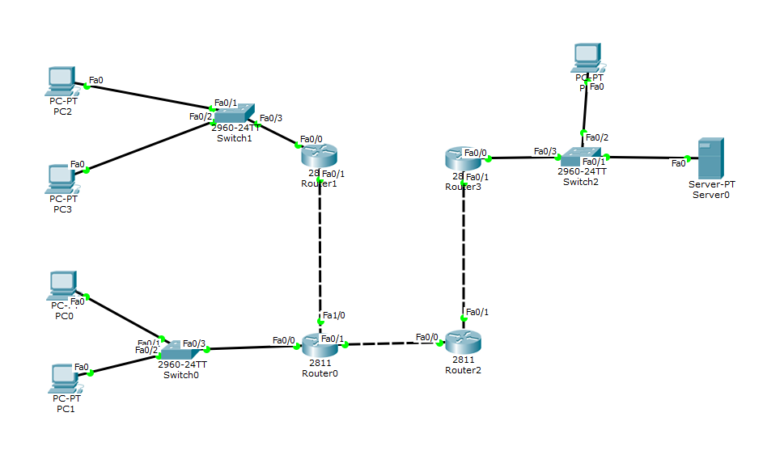
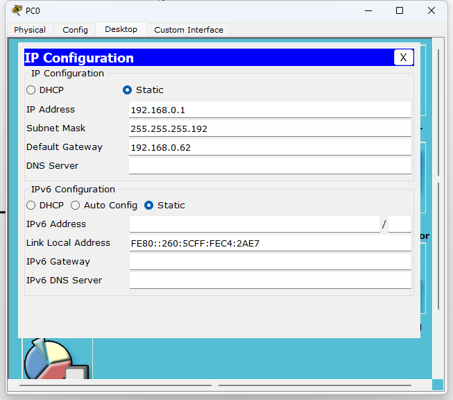
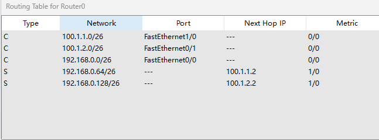
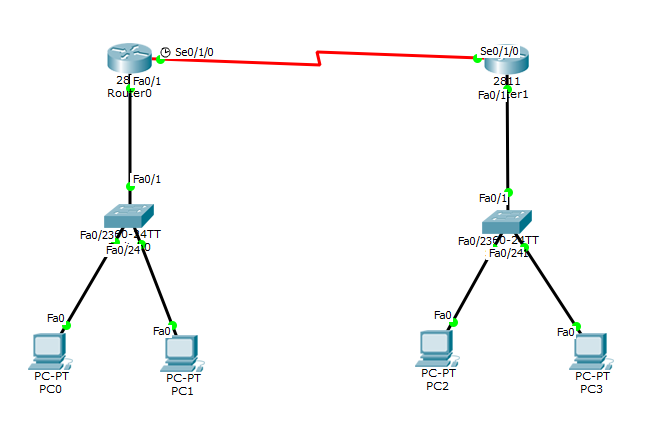
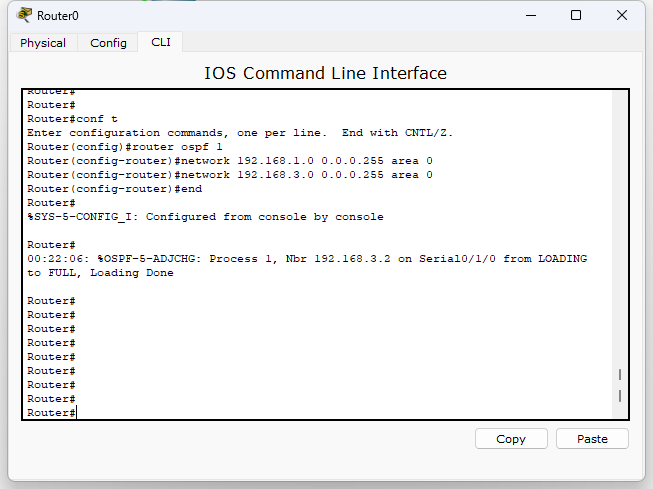

# IP路由协议分析

### 1 实验目的

1.掌握主机和路由器的IP地址配置；

2.掌握路由器转发IP数据包的流程；

3.理解ARP的工作原理；

4.理解网络路由，学习静态路由配置能力；

5.理解OSPF动态路由协议的工作原理。

### 2 实验设备

计算机、Cisco packet tracer。

### 3 实验原理

#### 3.1 IP地址的划分

IP地址包括五大类，分别是A类、B类、C类、D类和E类。而地址由两个字段构成，分别是网络号和主机号。五种类别对应的字段分配位数如下表所示。

A类、B类和C类地址的网络号字段(在图中这个字段是灰色的)分别为1个、2个和3个字节长，而在网络号字段的最前面有1~3位的类别位，其数值分别规定为0，10和110。

A类、B类和C类地址的主机号字段分为3个、2个和1个字节长。

D类地址（前4位1110）用于多播（一对多通信）。

E类地址（前4位是1111）保留为以后用。

#### 3.2 网关

网关实质上就是一个网络通往其他网络的关口，也就是连接到本地网络的路由器的接口。当主机需要和外网通信时就必须配置默认网关地址，即默认的出口IP地址。如果主机发送的数据包的目的网络与本主机的网络地址不同，则需要将该数据包转发给默认网关地址指向的路由器，由该路由器负责将数据包转发到其他网络去网关接口应具有与本地网络相同的网络地址。

#### 3.3 ARP

ARP，即地址解析协议。TCP/IP网络使用ARP实现IP地址到MAC地址的动态解析。网络层使用逻辑地址（IP地址）作为互联网的编址方案，但实际的物理网络（以太网）采用硬件地址（MAC地址）来唯一识别设备。因此在实际网络的链路上传送数据帧时，最终还是必须使用硬件地址（MAC地址）。

#### 3.4 静态路由

静态路由是指管理员人工配置路由表，它只适用于简单的网络环境。要求管理员了解整个网络的拓扑信息和链路信息，并且当网络拓扑结构和链路状态发生变化时，所有路由器的路由表都需要人工进行调整修改。默认路由也是一种特殊的静态路由，是指当路由表中找不到匹配的出口表项时，路由器采取的路由选择。默认路由可减少路由表所占用的空间和搜索路由表所用的时间。

#### 3.5 OSPF协议

开放式最短路径优先（Open Shortest Path First, OSPF)是广泛使用的一种动态路由协议，它属于链路状态路由协议，大部分路由将由OSPF协议自动计算和生成，无须网络管理员人工配置，当网络拓扑发生变化时，协议可以自动计算、更正路由，极大方便网络管理。

### 4 实验内容

- 任务一：IP地址分配

1.构建如下网络拓扑结构图

2.为路由器Router0添加FastEthernet接口

单击Router0，在physical（物理）选项卡下，点击右上方实物图上的电源开关关闭路由器，在左边找到NM-2FE2W模块（该模块提供两个FastEthernet接口），拖动到右边合适的空槽中，然后打开电源，如下图所示。

3.配置PC机和各路由器的IP地址（以子关掩码为255.255.255.192分成四个C类网段）

| 设备 | 接口 |  IP地址 | 子网掩码 | 默认网关 |
| :----------: | :----------: | :----------: | :----------: | :----------: |
| PC0 |  Fa0  | 192.168.0.1 | 255.255.255.192 | 192.168.0.62 |
| PC1 |  Fa0  | 192.168.0.2 | 255.255.255.192 | 192.168.0.62 |
| PC2 |  Fa0  | 192.168.0.65 | 255.255.255.192 | 192.168.0.126 |
| PC3 |  Fa0  | 192.168.0.66 | 255.255.255.192 | 192.168.0.126 |
| PC4 |  Fa0  | 192.168.0.130 | 255.255.255.192 | 192.168.0.190 |
| Server0 |  Fa0  | 192.168.0.129 | 255.255.255.192 | 192.168.0.190 |
| Router0 |  Fa0/0  | 192.168.0.62 | 255.255.255.192 | / |
| Router0 |  Fa0/1  | 100.1.2.1 | 255.255.255.192 | / |
| Router0 |  Fa1/0  | 100.1.1.1 | 255.255.255.192 | / |
| Router1 |  Fa0/0  | 192.168.0.126 | 255.255.255.192 | / |
| Router1 |  Fa0/1  | 100.1.1.2 | 255.255.255.192 | / |
| Router2 |  Fa0/0  | 100.1.2.2 | 255.255.255.192 | / |
| Router2 |  Fa0/1  | 100.1.3.1 | 255.255.255.192 | / |
| Router3 |  Fa0/0  | 192.168.0.190 | 255.255.255.192 | / |
| Router3 |  Fa0/1  | 100.1.3.2 | 255.255.255.192 | / |

单击PC0，在弹出的菜单中选择“IP Configuration”选项，对PC0的IP地址配置如下图所示，其余IP配置操作类似。

4.在路由器上配置静态路由

配置静态路由命令如下：

ip route [network] [mask] [address]

ip route:创建静态路由；

network:目标网络号；

mask:目标子网掩码；

address:下一跳的IP地址。

例如在Router0上输入：Router(config)#ip route 192.168.0.64 255.255.255.192 100.1.1.2代表告诉Router0要访问192.168.0.64/26下一跳到100.1.1.2去寻找。其余路由器静态配置操作类似。

5.查看路由表(routing table)

在配置好PC和路由器IP地址，配置好了静态路由后，可以选择查看各个路由器的路由表。选择工具栏中的Inspect工具，分别单击各路由器，在弹出的菜单中选择Routing Table，查看各路由器路由表信息，C表示直接连接，S表示静态路由。Router0的路由表如下图所示。

6.验证连通性

在实时模式下，单击PC0输入命令:ping 192.168.0.65（PC2的地址）来验证对PC2的连通性，同时自行验证其余PC或者服务器之间的连通性，并且思考为什么会出现“Request time out”的情况。

7.在模拟模式下观测ARP和ICMP数据包转发

在Packet Tracer中，arp命令只支持两个参数a和d。

arp：不带参数，显示可用的选项。

arp -a：用于查看ARP缓存中已获取的所有MAC地址。

arp -d：删除ARP缓存中的所有项目。

在实时模式下，单击PC0，输入命令arp -d去删除PC0中的ARP缓存，之后输入arp -a可以发现此时PC0下没有ARP缓存，之后尝试连通其余PC，例如ping 192.168.0.65，之后再输入arp -a去观察此时PC0的ARP缓存表并记录。

在模拟模式下，观察记录下ARP和ICMP数据包的转发流程，并根据记录简要叙述数据包转发原理。

- 任务二：单区域OSPF协议配置

1.构建如下网络拓扑结构

2.配置IP地址

R0、R1中分别添加1个WIC-2T网卡模块，串口配置时钟频率设置为64000。

| 设备 | 接口 |  IP地址 | 子网掩码 | 默认网关 |
| :----------: | :----------: | :----------: | :----------: | :----------: |
| PC0 |  Fa0  | 192.168.1.2 | 255.255.255.0 | 192.168.1.1 |
| PC1 |  Fa0  | 192.168.1.3 | 255.255.255.0 | 192.168.1.1 |
| PC2 |  Fa0  | 192.168.2.2 | 255.255.255.0 | 192.168.2.1 |
| PC3 |  Fa0  | 192.168.2.3 | 255.255.255.0 | 192.168.2.1 |
| Router0 |  Fa0/1  | 192.168.1.1 | 255.255.255.0 | / |
| Router0 |  Se0/1/0  | 192.168.3.1 | 255.255.255.0 | / |
| Router1 |  Fa0/1  | 192.168.2.1 | 255.255.255.0 | / |
| Router1 |  Se0/1/0  | 192.168.3.2 | 255.255.255.0 | / |

3.配置 OSPF路由协议

为Router0配置OSPF协议命令如下图,Router1配置类似。

4.查看路由表，验证连通性，记录下并且简要说明OSPF协议原理

5.用任一语言实验一个Dijkatra算法

