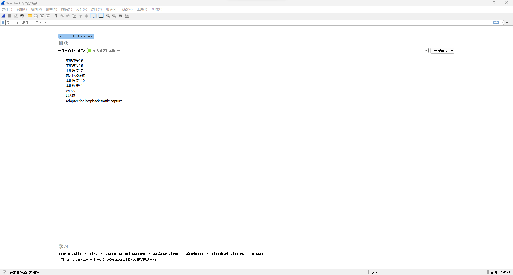

# 网络常用命令和Wireshark抓包软件的使用

### 1 实验目的

- 掌握网络常用命令的使用。 

- 学习检测本机连网的配置情况及故障分析诊断。

- 学习Wireshark软件的基本使用并进行协议分析。

### 2 实验环境

- 网络连接正常的计算机。

- Wireshark软件。

### 3 实验内容

#### 3.1 网络常用命令的使用

1. 查看网络配置

1）Ipconfig/all命令：

查看和修改网络中的TCP/IP协议的有关配置，例如本机IP地址、子网掩码、网关IP地址、DNS服务器IP地址等。

2）arp/a或arp -a命令：

查看地址解析表以检测网关及与自己主机相连接主机的IP和MAC地址。

2. 检查网络连通性：ping命令

1) ping 127.0.0.1：

ping该环回地址将测试包回送本机IP软件，验证在本地计算机上是否正确地安装了TCP/IP协议，以及配置是否正确。

2) ping localhost：

localhost是个网络保留名，127.0.0.1的别名，每台计算机均应能将该名字转换成该地址。如果没有，表明主机文件存在问题。

3) ping 本机IP地址：

该命令被送往本地计算机的IP地址，如果没有应答，表示本地配置或安装存在问题。

4) ping 本机主机名：

本机主机名是本机IP地址的别名，每台计算机均应将其主机名转换成该地址。如果没有，表明主机文件存在问题。

5) ping 本网网关路由器IP地址：

如果应答正常，表示局域网中的网关路由器正在运行并能够作出应答。说明本网直至连入Internet的路由器均正常。

6) ping 因特网上某主机IP地址或域名：

如果应答正常，说明本机能正常上因特网且该主机正常连接入Internet。否则若ping IP地址正常而ping 主机域名不正常，说明域名系统DNS服务器工作故障不能解析域名；若ping IP地址不通，判断网关是否出现工作故障，没有连接Internet。

3. 网络协议统计：Netstat命令

观察本机当前连接的所有端口、套接字、各协议网络状态统计信息。

4. 传输路径测试：tracert命令

测试传输路径及所需时间。

5、解析域名：nslookup命令

连接DNS服务器解析域名，可查询到其对应IP地址和主机名及所有别名等域名信息。还可实现反向解析把IP地址反向解析为域名。

#### 3.2 Wireshark软件抓包

使用Wireshark软件进行抓包，并按照以下要求分别进行数据包过滤和协议分析。

1. 数据包过滤

1）地址过滤

显示源IP地址或目标IP地址为本机IP地址的数据包列表。

2）端口过滤

显示源主机或目的主机端口为80的数据包列表。

3）http模式过滤

显示http GET方法的数据包列表。

4）协议过滤

显示TCP协议和UDP协议的数据包列表。

2. 协议分析

分别对过滤得到的TCP数据包和UDP数据包进行协议分析。

