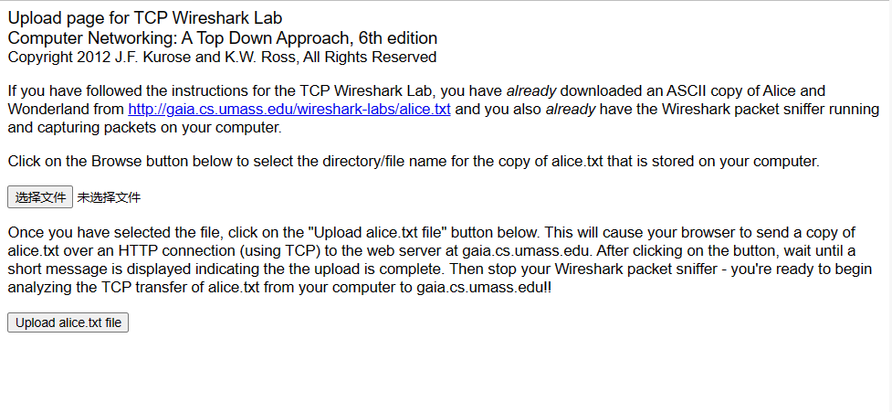
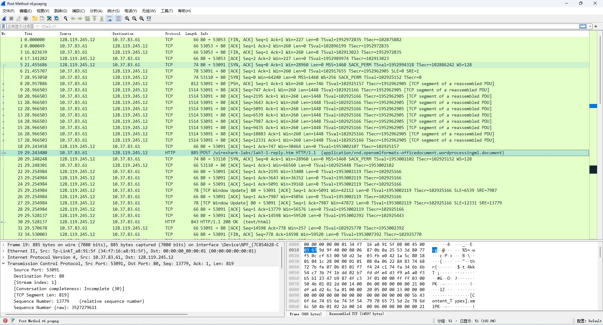
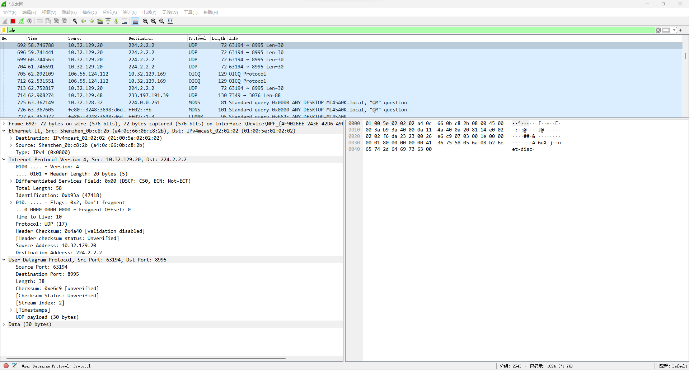

# 网络常用命令和Wireshark抓包软件的使用

### 1 实验目的

- 掌握网络常用命令的使用。 

- 学习检测本机连网的配置情况及故障分析诊断。

- 学习Wireshark软件的基本使用并进行协议分析。

### 2 实验环境

- 网络连接正常的计算机。

- Wireshark软件。

### 3 实验内容

#### 3.1 网络常用命令的使用

- 查看网络配置

1）Ipconfig/all命令：

查看和修改网络中的TCP/IP协议的有关配置，例如本机IP地址、子网掩码、网关IP地址、DNS服务器IP地址等。

2）arp/a或arp -a命令：

查看地址解析表以检测网关及与自己主机相连接主机的IP和MAC地址。

- 检查网络连通性：ping命令

1）ping 127.0.0.1：

ping该环回地址将测试包回送本机IP软件，验证在本地计算机上是否正确地安装了TCP/IP协议，以及配置是否正确。

2）ping localhost：

localhost是个网络保留名，127.0.0.1的别名，每台计算机均应能将该名字转换成该地址。如果没有，表明主机文件存在问题。

3）ping 本机IP地址：

该命令被送往本地计算机的IP地址，如果没有应答，表示本地配置或安装存在问题。

4）ping 本机主机名：

本机主机名是本机IP地址的别名，每台计算机均应将其主机名转换成该地址。如果没有，表明主机文件存在问题。

5）ping 本网网关路由器IP地址：

如果应答正常，表示局域网中的网关路由器正在运行并能够作出应答。说明本网直至连入Internet的路由器均正常。

6）ping 因特网上某主机IP地址或域名：

如果应答正常，说明本机能正常上因特网且该主机正常连接入Internet。否则若ping IP地址正常而ping 主机域名不正常，说明域名系统DNS服务器工作故障不能解析域名；若ping IP地址不通，判断网关是否出现工作故障，没有连接Internet。

- 网络协议统计：Netstat命令

观察本机当前连接的所有端口、套接字、各协议网络状态统计信息。

- 传输路径测试：tracert命令

测试传输路径及所需时间。

- 解析域名：nslookup命令

连接DNS服务器解析域名，可查询到其对应IP地址和主机名及所有别名等域名信息。还可实现反向解析把IP地址反向解析为域名。

#### 3.2 Wireshark软件抓包

使用Wireshark软件进行抓包，并按照以下要求分别进行数据包过滤和协议分析。

- 数据包过滤

1）地址过滤

显示源IP地址或目标IP地址为本机IP地址的数据包列表。

2）端口过滤

显示源主机或目的主机端口为80的数据包列表。

3）http模式过滤

显示http GET方法的数据包列表。

4）协议过滤

显示TCP协议和UDP协议的数据包列表。

- 协议分析

1）捕获从本地计算机到远程服务器的批量TCP传输

在开始探索TCP之前，我们需要使用Wireshark来获取一个文件从你的计算机到远程服务器的TCP传输的数据包跟踪。你将通过访问一个网页来实现，该网页将允许你输入存储在你的计算机上的一个文件的名称，然后使用HTTP POST方法将该文件传输到一个Web服务器。我们使用POST方法而不是GET方法，因为我们想把大量的数据从你的计算机传输到另一台计算机。在此期间我们将运行Wireshark，以获得从你的计算机发送和接收的TCP段的跟踪。

访问http://gaia.cs.umass.edu/wireshark-labs/TCP-wireshark-file1.html ，显示如下：

 
点击“Browse”，选择要上传的文件。启动Wireshark并开始捕获数据。返回浏览器，点击“Upload file”。停止Wireshark数据包捕获，此时应该显示如下内容：

用抓包结果回答下列关于TCP区段的问题：

a. 客户端（源计算机）的IP和端口号是多少？服务器的IP和端口号是多少？

b. 客户端（源计算机）和服务器之间启动TCP连接的TCP SYN区段的序列号是什么？该序列号的作用是什么？

c. 结合实例介绍“三次握手”和“四次挥手”的过程。

d. 服务器发送给客户端以回复SYN的SYNACK区段的序列号是多少？该序列号的作用是什么？

e. 包含HTTP POST命令的TCP区段的序列号是多少？

f. RTT(Round Trip Time)分析。将包含PSH ACK视为TCP连接中的第一个区段，假设第一个EstimatedRTT的值等于第一个区段的测量RTT，计算后续区段的EstimatedRTT。
（EstimatedRTT=0.875·EstimatedRTT+0.125·SampleRTT）

h. 在跟踪文件中是否有重传的区段？

i. TCP连接的吞吐量是多少？如何计算。

2）设置数据包筛选器，以便 Wireshark 仅显示在主机上发送和接收的UDP数据包。选择其中一个UDP数据包并在详细信息窗口中展开UDP字段，如下图所示。

用抓包结果回答下列关于UDP区段的问题：

a. 从你的追踪中选择一个UDP数据包，确定UDP头部有多少个字段，分别是什么？

b. 通过查询UDP数据包内容字段中显示的信息，确定每个UDP头部字段的长度（字节）。

c. Length字段由什么组成？

d. UDP有效载荷中可包含的最大字节数是多少？最大的可能源端口编号是多少？

e. UDP的协议编号是多少？用十六进制表示是什么？

f. 检查主机发送的一对UDP数据包，第二个UDP数据包是对第一个UDP数据包的回复。描述两个数据包中的端口编号之间的关系。
